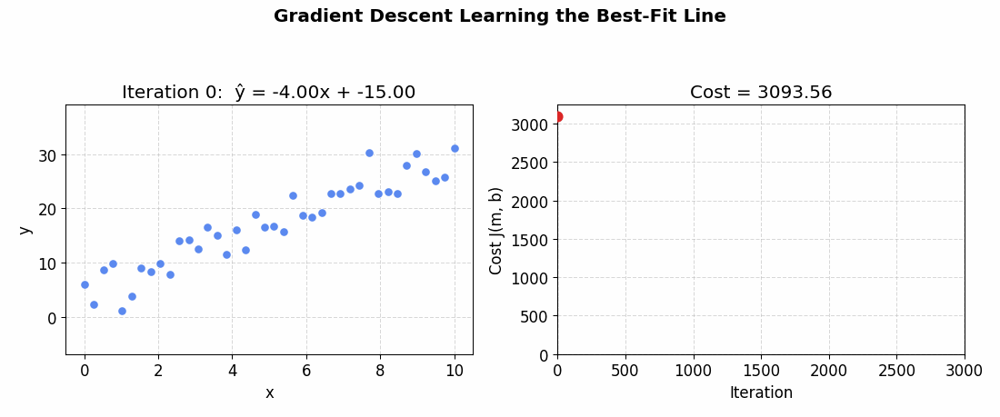
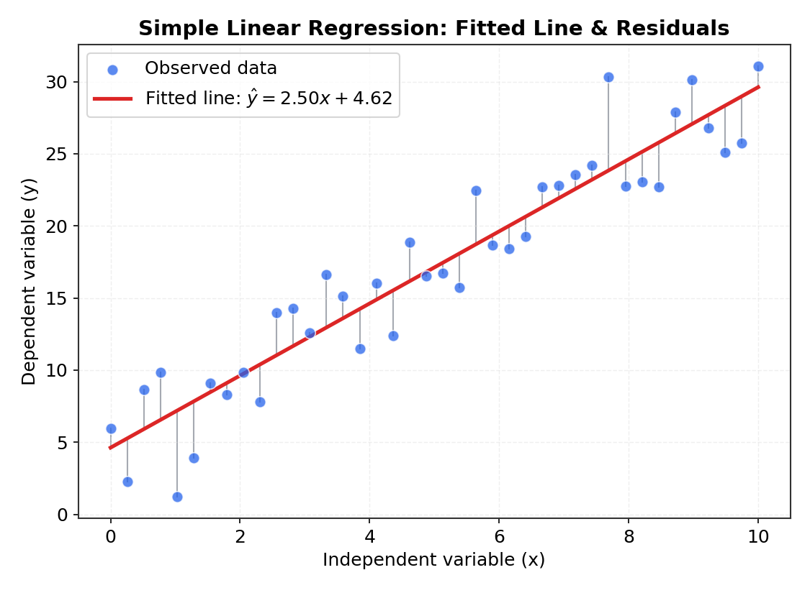
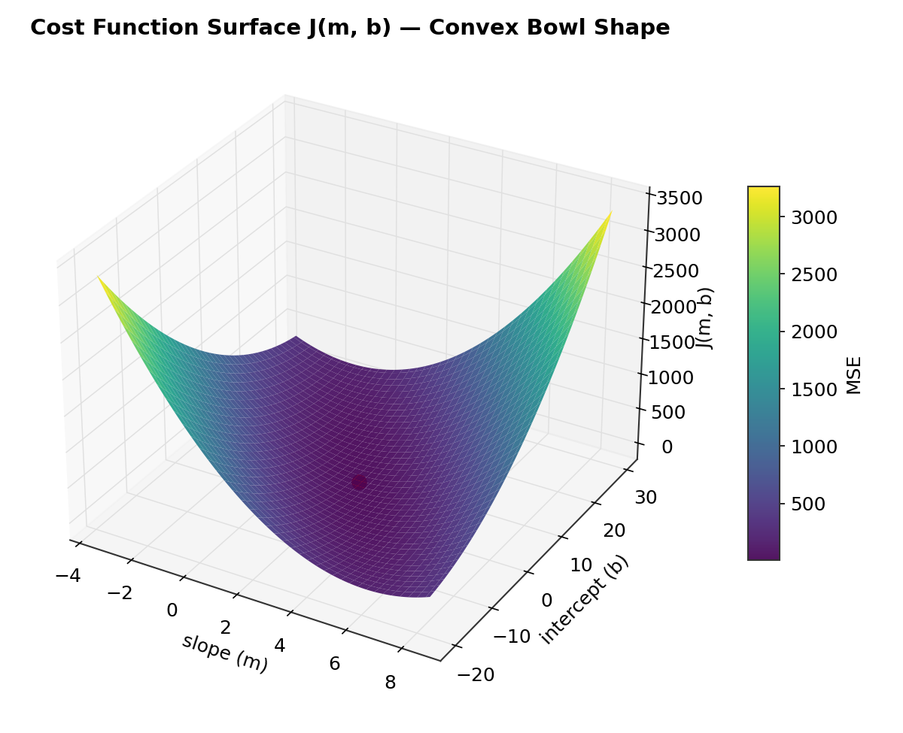
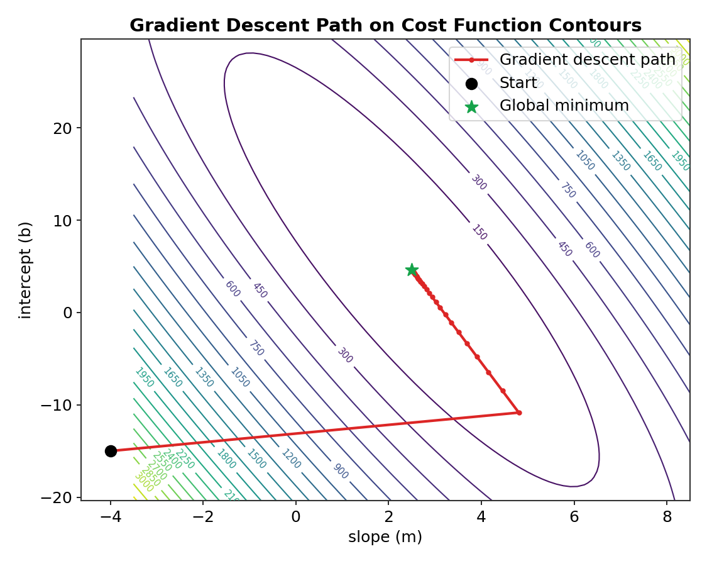
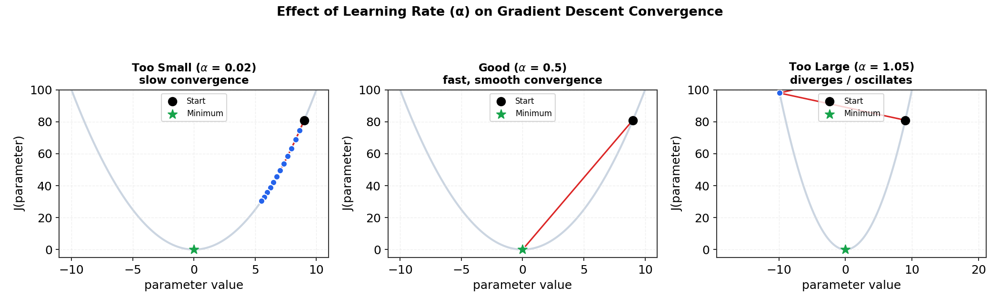
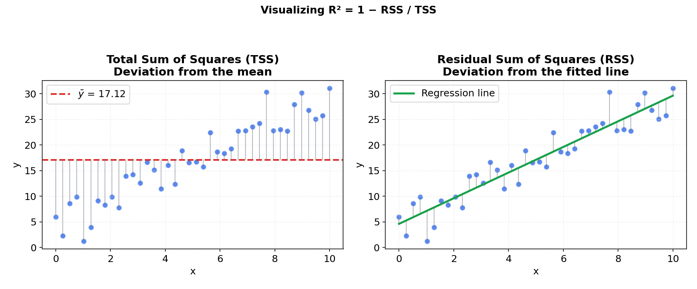
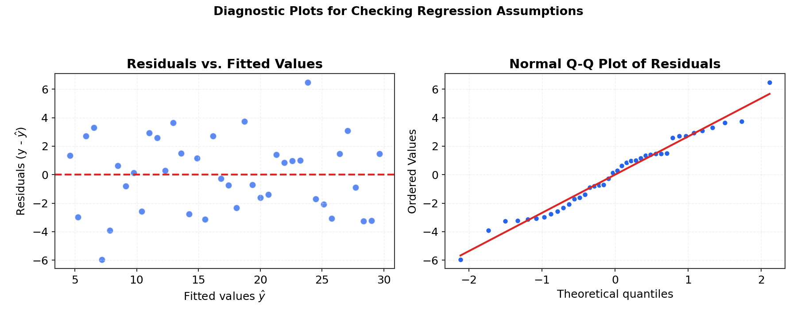
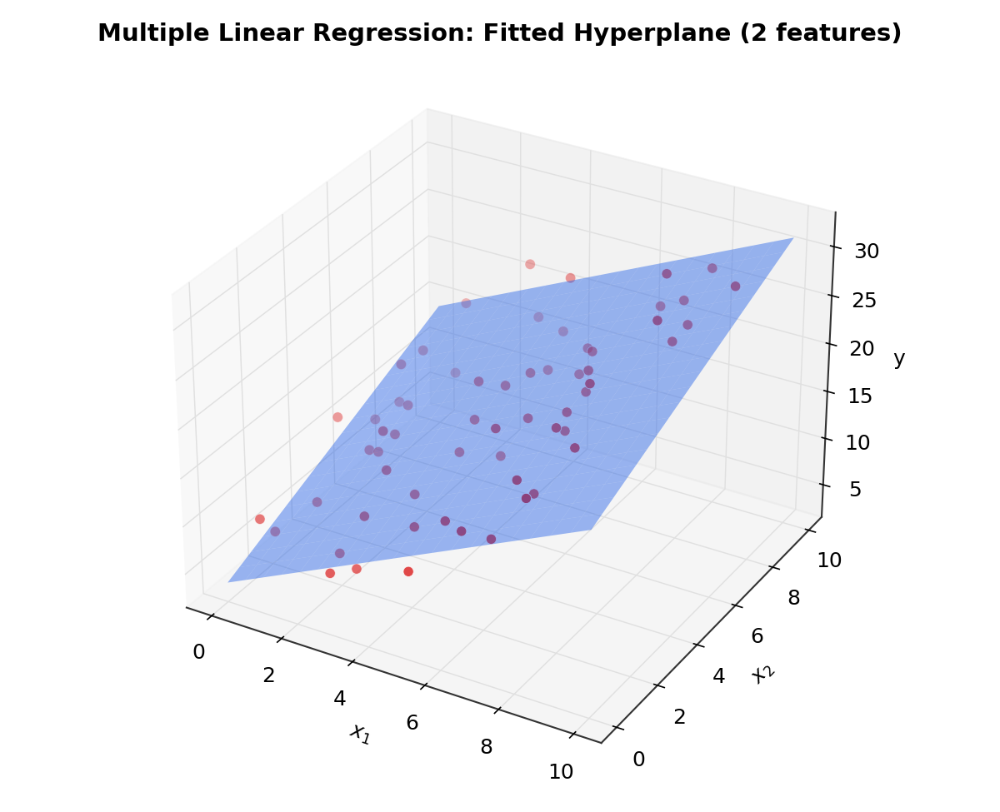

# 📈 Linear Regression — A Complete Study Guide


> A from-first-principles guide to Linear Regression — definitions, full mathematical proofs, and visualizations for every core idea. Built as self-contained study material.

<p align="center">
  
</p>

---

## 📑 Table of Contents

1. [Introduction](#1-introduction)
2. [Mathematical Formulation of the Model](#2-mathematical-formulation-of-the-model)
3. [Assumptions of Linear Regression](#3-assumptions-of-linear-regression)
4. [The Cost Function](#4-the-cost-function)
5. [Ordinary Least Squares — The Normal Equation](#5-ordinary-least-squares--the-normal-equation)
   - [5.1 Simple Linear Regression (scalar derivation)](#51-simple-linear-regression-scalar-derivation)
   - [5.2 Multiple Linear Regression (matrix derivation)](#52-multiple-linear-regression-matrix-derivation)
6. [Gradient Descent](#6-gradient-descent)
7. [Model Evaluation Metrics](#7-model-evaluation-metrics)
8. [Checking the Assumptions — Residual Diagnostics](#8-checking-the-assumptions--residual-diagnostics)
9. [Multiple Linear Regression in Practice](#9-multiple-linear-regression-in-practice)
10. [Regularization — Ridge & Lasso](#10-regularization--ridge--lasso)
11. [Python Implementation](#11-python-implementation)
12. [Visual Gallery](#12-visual-gallery)
13. [Summary Cheat Sheet](#13-summary-cheat-sheet)
14. [References](#14-references)

---

## 1. Introduction

**Linear Regression** is a supervised learning algorithm that models the relationship between a dependent variable (the *target*, $y$) and one or more independent variables (the *features*, $x$) by fitting a straight line (or hyperplane, in higher dimensions) through the data. It is the foundation of statistical modeling and the starting point for almost every other regression technique in machine learning.

Formally, linear regression assumes the target is, on average, a **linear combination** of the input features plus some random noise:

$$y = f(x) + \varepsilon$$

where $f(x)$ is linear in its parameters and $\varepsilon$ is an irreducible error term.

### 1.1 Why "Linear"?

The model is called *linear* not because the relationship between $x$ and $y$ must be a straight line in every visual sense, but because the model is **linear in its parameters** ($\beta_0, \beta_1, \dots$). For instance, $y = \beta_0 + \beta_1 x + \beta_2 x^2$ is still a *linear regression model*, even though it traces a curve, because it is a linear combination of the coefficients.

### 1.2 Types of Linear Regression

| Type | Description | Equation |
|---|---|---|
| **Simple Linear Regression** | One independent variable predicts one dependent variable | $y = \beta_0 + \beta_1 x + \varepsilon$ |
| **Multiple Linear Regression** | Two or more independent variables predict one dependent variable | $y = \beta_0 + \beta_1 x_1 + \beta_2 x_2 + \dots + \beta_p x_p + \varepsilon$ |
| **Polynomial Regression** | A special case of multiple regression using powers of a single variable | $y = \beta_0 + \beta_1 x + \beta_2 x^2 + \dots + \varepsilon$ |

### 1.3 Where It's Used

Linear regression is used for trend analysis (sales forecasting, stock trend estimation), risk assessment (insurance, credit scoring), scientific measurement (dose-response curves), and as a diagnostic baseline before trying more complex models.

<p align="center">
  
  <br>
  <em>Figure 1: A simple linear regression fit. The red line is the model's prediction; gray segments are residuals (errors).</em>
</p>

---

## 2. Mathematical Formulation of the Model

### 2.1 Simple Linear Regression

For a single feature $x$, the model is:

$$\hat{y} = \beta_0 + \beta_1 x$$

- $\hat{y}$ — the **predicted** value of the target
- $\beta_0$ — the **intercept** (value of $\hat{y}$ when $x = 0$)
- $\beta_1$ — the **slope** (change in $\hat{y}$ for a one-unit change in $x$)

The *true* relationship includes an unobservable noise term:

$$y_i = \beta_0 + \beta_1 x_i + \varepsilon_i, \qquad \varepsilon_i \sim \mathcal{N}(0, \sigma^2)$$

The noise term $\varepsilon_i$ absorbs measurement error and the effect of any unmodeled variables. We don't observe $\varepsilon_i$ directly — we only ever see realized residuals $e_i = y_i - \hat y_i$ once a model is fit.

### 2.2 Multiple Linear Regression (Matrix Form)

With $p$ features, it's more convenient to switch to matrix notation. For $n$ observations:

$$
\mathbf{y} = \begin{bmatrix} y_1 \\ y_2 \\ \vdots \\ y_n \end{bmatrix}, \quad
\mathbf{X} = \begin{bmatrix}
1 & x_{11} & x_{12} & \dots & x_{1p} \\
1 & x_{21} & x_{22} & \dots & x_{2p} \\
\vdots & \vdots & \vdots & \ddots & \vdots \\
1 & x_{n1} & x_{n2} & \dots & x_{np}
\end{bmatrix}, \quad
\boldsymbol{\beta} = \begin{bmatrix} \beta_0 \\ \beta_1 \\ \vdots \\ \beta_p \end{bmatrix}
$$

The leading column of 1's in $\mathbf{X}$ lets the intercept $\beta_0$ be absorbed into the matrix product. The model becomes:

$$\mathbf{y} = \mathbf{X}\boldsymbol{\beta} + \boldsymbol{\varepsilon}$$

and the prediction for any input row $\mathbf{x}_i$ is simply $\hat y_i = \mathbf{x}_i^\top \boldsymbol{\beta}$.

---

## 3. Assumptions of Linear Regression

OLS estimates are only statistically valid (unbiased, minimum-variance, with trustworthy p-values) when these conditions hold. They're commonly remembered by the acronym **L.I.N.E.**:

| # | Assumption | What it means | What breaks if violated |
|---|---|---|---|
| 1 | **L**inearity | The relationship between $X$ and $E[y]$ is genuinely linear in the parameters | Predictions are systematically biased |
| 2 | **I**ndependence | Residuals are independent of each other (no autocorrelation) | Standard errors become unreliable (common in time series) |
| 3 | **N**ormality | Residuals are approximately normally distributed | Confidence intervals & hypothesis tests become invalid |
| 4 | **E**qual variance (Homoscedasticity) | Residual variance is constant across all fitted values | Some predictions become more "trustworthy" than the model reports |
| 5 | No **multicollinearity** | Features aren't highly correlated with each other (multiple regression only) | Coefficient estimates become unstable and hard to interpret |

These assumptions are checked visually using **residual diagnostic plots** — see [Section 8](#8-checking-the-assumptions--residual-diagnostics).

---

## 4. The Cost Function

To fit a line, we need a way to measure *how wrong* a given choice of $\beta_0, \beta_1$ is. This is the job of a **cost function** (also called a **loss function**).

### 4.1 Definition — Mean Squared Error (MSE)

$$J(\beta_0, \beta_1) = \frac{1}{n} \sum_{i=1}^{n} \left(y_i - \hat{y}_i\right)^2 = \frac{1}{n} \sum_{i=1}^{n} \left(y_i - (\beta_0 + \beta_1 x_i)\right)^2$$

We square the errors instead of just summing $(y_i - \hat y_i)$ directly for two reasons: positive and negative errors would otherwise cancel out and hide how wrong the model really is, and squaring penalizes large errors more heavily than small ones, which produces a smooth, differentiable function that's easy to optimize.

<p align="center">
  
  <br>
  <em>Figure 2: The MSE cost function J(m, b) is a convex "bowl." Because it's convex, it has exactly one minimum — gradient-based methods are guaranteed to find it.</em>
</p>

### 4.2 Proof: Why Squared Error? (The Maximum Likelihood Justification)

This isn't an arbitrary choice — minimizing squared error is mathematically *equivalent* to finding the most probable line, **given the assumption that noise is Gaussian**. Here is the proof.

**Setup.** Assume each observation is generated as:

$$y_i = \beta_0 + \beta_1 x_i + \varepsilon_i, \qquad \varepsilon_i \overset{\text{iid}}{\sim} \mathcal{N}(0, \sigma^2)$$

Since $\varepsilon_i = y_i - (\beta_0 + \beta_1 x_i)$ is Gaussian with mean 0, the variable $y_i$ itself, conditioned on $x_i$, is Gaussian with mean $\beta_0 + \beta_1 x_i$ and variance $\sigma^2$:

$$p(y_i \mid x_i; \beta_0, \beta_1) = \frac{1}{\sqrt{2\pi\sigma^2}} \exp\left(-\frac{(y_i - \beta_0 - \beta_1 x_i)^2}{2\sigma^2}\right)$$

**Step 1 — Write the likelihood.** Assuming observations are independent, the likelihood of the entire dataset is the product of individual densities:

$$L(\beta_0, \beta_1) = \prod_{i=1}^{n} \frac{1}{\sqrt{2\pi\sigma^2}} \exp\left(-\frac{(y_i - \beta_0 - \beta_1 x_i)^2}{2\sigma^2}\right)$$

**Step 2 — Take the log-likelihood.** Products are hard to differentiate; logs turn them into sums without changing where the maximum is (log is monotonic):

$$\ell(\beta_0, \beta_1) = \log L(\beta_0, \beta_1) = \sum_{i=1}^{n} \left[ -\frac{1}{2}\log(2\pi\sigma^2) - \frac{(y_i - \beta_0 - \beta_1 x_i)^2}{2\sigma^2} \right]$$

$$\ell(\beta_0, \beta_1) = -\frac{n}{2}\log(2\pi\sigma^2) \; - \; \frac{1}{2\sigma^2}\sum_{i=1}^{n} (y_i - \beta_0 - \beta_1 x_i)^2$$

**Step 3 — Maximize.** The first term doesn't depend on $\beta_0, \beta_1$ at all, so maximizing $\ell$ with respect to the coefficients is the same as maximizing $-\sum (y_i - \beta_0 - \beta_1 x_i)^2$, which is the same as **minimizing** $\sum (y_i - \beta_0 - \beta_1 x_i)^2$:

$$\arg\max_{\beta_0,\beta_1} \ell(\beta_0, \beta_1) \;=\; \arg\min_{\beta_0,\beta_1} \sum_{i=1}^{n}(y_i - \beta_0 - \beta_1 x_i)^2$$

This is exactly the MSE cost function (up to the constant $1/n$, which doesn't affect *where* the minimum is). $\blacksquare$

**Conclusion:** Ordinary Least Squares isn't just "a reasonable idea" — it's the maximum-likelihood estimator under the assumption of Gaussian-distributed errors. This is precisely *why* the normality assumption in Section 3 matters: it's what makes least-squares optimal in the first place.

---

## 5. Ordinary Least Squares — The Normal Equation

"Ordinary Least Squares" (OLS) is the method of choosing $\beta_0, \beta_1, \dots$ to minimize the sum of squared errors. Because the cost function is a smooth convex bowl (Figure 2), we can find its exact minimum analytically using calculus — by setting the gradient to zero. The resulting formula is called the **Normal Equation**.

### 5.1 Simple Linear Regression (scalar derivation)

**Goal:** minimize $J(\beta_0, \beta_1) = \sum_{i=1}^n (y_i - \beta_0 - \beta_1 x_i)^2$ with respect to $\beta_0$ and $\beta_1$.

(Dropping the $\frac{1}{n}$ factor here doesn't change *where* the minimum occurs, only the cost value — so we work with the plain sum of squares for cleaner algebra.)

**Step 1 — Partial derivative with respect to $\beta_0$, set to zero:**

$$\frac{\partial J}{\partial \beta_0} = -2\sum_{i=1}^n (y_i - \beta_0 - \beta_1 x_i) = 0$$

$$
\implies \sum y_i - n\beta_0 - \beta_1 \sum x_i = 0 \implies \boxed{\beta_0 = \bar y - \beta_1 \bar x} \qquad (i)
$$

**Step 2 — Partial derivative with respect to $\beta_1$, set to zero:**

$$\frac{\partial J}{\partial \beta_1} = -2\sum_{i=1}^n x_i(y_i - \beta_0 - \beta_1 x_i) = 0$$

$$\implies \sum x_i y_i - \beta_0 \sum x_i - \beta_1 \sum x_i^2 = 0 \tag{ii}$$

**Step 3 — Substitute (i) into (ii)** to eliminate $\beta_0$:

$$\sum x_i y_i - (\bar y - \beta_1 \bar x)\sum x_i - \beta_1 \sum x_i^2 = 0$$

Using $\sum x_i = n\bar x$:

$$\sum x_i y_i - n\bar x \bar y + \beta_1 \left(n\bar x^2 - \sum x_i^2\right) = 0$$

$$\implies \beta_1 = \frac{\sum x_i y_i - n\bar x \bar y}{\sum x_i^2 - n\bar x^2}$$

**Step 4 — Rewrite in the familiar "covariance over variance" form.** Using the algebraic identity (easily verified by expanding both sides):

$$\sum_{i=1}^n (x_i - \bar x)(y_i - \bar y) = \sum x_i y_i - n\bar x \bar y, \qquad \sum_{i=1}^n (x_i - \bar x)^2 = \sum x_i^2 - n\bar x^2$$

we arrive at the closed-form slope estimator:

$$\boxed{\beta_1 = \frac{\sum_{i=1}^n (x_i - \bar x)(y_i - \bar y)}{\sum_{i=1}^n (x_i - \bar x)^2} = \frac{\text{Cov}(x,y)}{\text{Var}(x)}}$$

and from (i):

$$\boxed{\beta_0 = \bar y - \beta_1 \bar x}$$

**Confirming it's a minimum, not a maximum:** the second derivatives are $\frac{\partial^2 J}{\partial \beta_1^2} = 2\sum x_i^2 \geq 0$ and the Hessian determinant is positive (as long as not all $x_i$ are identical), so $J$ is convex and this critical point is the unique global minimum. $\blacksquare$

### 5.2 Multiple Linear Regression (matrix derivation)

For $p \geq 2$ features, working coefficient-by-coefficient becomes unwieldy — we switch to matrix calculus, which generalizes the same idea.

**Goal:** minimize the sum of squared errors, written compactly as a vector norm:

$$J(\boldsymbol\beta) = (\mathbf{y} - \mathbf{X}\boldsymbol\beta)^\top(\mathbf{y} - \mathbf{X}\boldsymbol\beta)$$

**Step 1 — Expand the quadratic form:**

$$J(\boldsymbol\beta) = \mathbf{y}^\top\mathbf{y} - \mathbf{y}^\top\mathbf{X}\boldsymbol\beta - \boldsymbol\beta^\top\mathbf{X}^\top\mathbf{y} + \boldsymbol\beta^\top\mathbf{X}^\top\mathbf{X}\boldsymbol\beta$$

Since $\mathbf{y}^\top\mathbf{X}\boldsymbol\beta$ is a scalar, it equals its own transpose $\boldsymbol\beta^\top\mathbf{X}^\top\mathbf{y}$, so the two middle terms combine:

$$J(\boldsymbol\beta) = \mathbf{y}^\top\mathbf{y} - 2\boldsymbol\beta^\top\mathbf{X}^\top\mathbf{y} + \boldsymbol\beta^\top\mathbf{X}^\top\mathbf{X}\boldsymbol\beta$$

**Step 2 — Differentiate with respect to the vector $\boldsymbol\beta$.** This step uses two standard matrix-calculus identities:

$$\frac{\partial}{\partial \boldsymbol\beta}\left(\mathbf{a}^\top \boldsymbol\beta\right) = \mathbf{a}, \qquad \frac{\partial}{\partial \boldsymbol\beta}\left(\boldsymbol\beta^\top \mathbf{A} \boldsymbol\beta\right) = 2\mathbf{A}\boldsymbol\beta \;\; \text{(for symmetric } \mathbf{A}\text{)}$$

*(Brief justification of the second identity: writing $\boldsymbol\beta^\top \mathbf{A}\boldsymbol\beta = \sum_j \sum_k A_{jk}\beta_j\beta_k$ and differentiating component-wise with respect to $\beta_m$ gives $\sum_k A_{mk}\beta_k + \sum_j A_{jm}\beta_j = 2\sum_k A_{mk}\beta_k$ when $\mathbf A$ is symmetric, i.e. the $m$-th entry of $2\mathbf A \boldsymbol\beta$ — this holds for every $m$, proving the identity.)*

Applying these with $\mathbf{a} = \mathbf{X}^\top\mathbf{y}$ and $\mathbf{A} = \mathbf{X}^\top\mathbf{X}$ (which is always symmetric):

$$\frac{\partial J}{\partial \boldsymbol\beta} = -2\mathbf{X}^\top\mathbf{y} + 2\mathbf{X}^\top\mathbf{X}\boldsymbol\beta$$

**Step 3 — Set the gradient to zero and solve:**

$$-2\mathbf{X}^\top\mathbf{y} + 2\mathbf{X}^\top\mathbf{X}\boldsymbol\beta = \mathbf{0}$$

$$\mathbf{X}^\top\mathbf{X}\boldsymbol\beta = \mathbf{X}^\top\mathbf{y}$$

Assuming $\mathbf{X}^\top\mathbf{X}$ is invertible (i.e. no perfect multicollinearity — see Section 3), multiply both sides by $(\mathbf{X}^\top\mathbf{X})^{-1}$:

$$\boxed{\boldsymbol\beta = (\mathbf{X}^\top\mathbf{X})^{-1}\mathbf{X}^\top\mathbf{y}}$$

This is the **Normal Equation**. It gives the *exact* OLS solution in a single step — no iteration required.

**Confirming it's a minimum:** the Hessian of $J$ is $\frac{\partial^2 J}{\partial \boldsymbol\beta \, \partial \boldsymbol\beta^\top} = 2\mathbf{X}^\top\mathbf{X}$, which is positive semi-definite for any $\mathbf{X}$ (since $\mathbf{v}^\top\mathbf{X}^\top\mathbf{X}\mathbf{v} = \|\mathbf{X}\mathbf{v}\|^2 \geq 0$ for all $\mathbf v$). This proves $J(\boldsymbol\beta)$ is convex, so the critical point found above is guaranteed to be a **global minimum**. $\blacksquare$

> **When to use the Normal Equation vs. Gradient Descent:** the Normal Equation is exact and requires no learning rate or iteration, but computing $(\mathbf{X}^\top\mathbf{X})^{-1}$ costs $O(p^3)$ — expensive when the number of features $p$ is large (thousands+). Gradient Descent (Section 6) scales much better in that regime.

---

## 6. Gradient Descent

The Normal Equation gives an exact answer, but it doesn't scale well to very large feature sets or massive datasets. **Gradient Descent** is an iterative alternative: start with a guess for the parameters, and repeatedly nudge them in the direction that reduces the cost fastest, until convergence.

### 6.1 The Core Idea

The gradient $\nabla J$ of a function points in the direction of **steepest ascent**. To *minimize* $J$, we move in the **opposite** direction:

$$\theta_{j} \leftarrow \theta_{j} - \alpha \frac{\partial J}{\partial \theta_j}$$

where $\theta_j$ is a parameter (e.g. $\beta_0$ or $\beta_1$) and $\alpha$ is the **learning rate** — a small positive number controlling step size.

### 6.2 Derivation of the Update Rule

Using the MSE cost function $J(\beta_0, \beta_1) = \frac{1}{n}\sum_{i=1}^n (y_i - \beta_0 - \beta_1 x_i)^2$, the partial derivatives (by the same differentiation shown in Section 5.1, just keeping the $\frac1n$ factor and not setting the result to zero) are:

$$\frac{\partial J}{\partial \beta_0} = -\frac{2}{n}\sum_{i=1}^n (y_i - \hat y_i), \qquad \frac{\partial J}{\partial \beta_1} = -\frac{2}{n}\sum_{i=1}^n x_i(y_i - \hat y_i)$$

Substituting into the general update rule gives the gradient descent rules for simple linear regression:

$$\boxed{\beta_0 \leftarrow \beta_0 + \frac{2\alpha}{n}\sum_{i=1}^n (y_i - \hat y_i)}$$

$$\boxed{\beta_1 \leftarrow \beta_1 + \frac{2\alpha}{n}\sum_{i=1}^n x_i(y_i - \hat y_i)}$$

Both parameters are updated **simultaneously** at every iteration, using the *old* values of $\beta_0, \beta_1$ to compute both gradients (updating one before computing the other would corrupt the gradient calculation). In matrix form, for multiple regression, the equivalent rule is:

$$\boldsymbol\beta \leftarrow \boldsymbol\beta + \frac{2\alpha}{n}\mathbf{X}^\top(\mathbf{y} - \mathbf{X}\boldsymbol\beta)$$

which is just the vectorized version of the same gradient derived in Section 5.2, evaluated *before* setting it to zero.

### 6.3 Visualizing Convergence

<p align="center">
  
  <br>
  <em>Figure 3: Each contour ring represents a constant cost value. Gradient descent always moves perpendicular to the contour lines — the direction of steepest descent — spiraling into the global minimum.</em>
</p>

The animation at the top of this document shows the same process from the *model's* point of view: as the parameters move along that contour path, the fitted line on the left visibly rotates and shifts into place while the cost curve on the right drops toward zero.

### 6.4 Choosing the Learning Rate ($\alpha$)

The learning rate is the single most important hyperparameter in gradient descent:

<p align="center">
  
  <br>
  <em>Figure 4: Too small wastes iterations; too large overshoots the minimum and can diverge; a well-tuned rate converges quickly and smoothly.</em>
</p>

A common practical strategy is to try several values on a log scale (e.g. $0.001, 0.01, 0.1, 1$) and pick the largest one that still converges smoothly, or to use adaptive optimizers (Adam, RMSProp) that adjust $\alpha$ automatically — relevant mostly in more complex models, but built on this exact same gradient idea.

### 6.5 Variants of Gradient Descent

| Variant | Update uses... | Pros | Cons |
|---|---|---|---|
| **Batch GD** | Entire dataset, every step | Stable, accurate gradient | Slow on large datasets |
| **Stochastic GD (SGD)** | One random sample per step | Fast, can escape shallow local minima | Noisy convergence path |
| **Mini-batch GD** | A small random subset (e.g. 32–256 rows) per step | Good balance — the industry-standard default | Needs batch-size tuning |

For ordinary linear regression with a convex cost surface, all three variants converge to the same global minimum — they only differ in *how smoothly and how fast* they get there.

---

## 7. Model Evaluation Metrics

Once a model is fit, we need numbers that quantify how good it actually is.

### 7.1 Error-Based Metrics

| Metric | Formula | Notes |
|---|---|---|
| **MAE** (Mean Absolute Error) | $\dfrac{1}{n}\sum \lvert y_i - \hat y_i \rvert$ | Same units as $y$; robust to outliers |
| **MSE** (Mean Squared Error) | $\dfrac{1}{n}\sum (y_i - \hat y_i)^2$ | Penalizes large errors heavily; this is the OLS cost function itself |
| **RMSE** (Root Mean Squared Error) | $\sqrt{\dfrac{1}{n}\sum (y_i - \hat y_i)^2}$ | Same units as $y$; more sensitive to outliers than MAE |

MSE and RMSE grow faster than MAE as an individual error grows, because the error is squared before being averaged — a single large miss contributes disproportionately to the total. This is precisely why MSE is the right choice as an *optimization target* (it heavily discourages large errors) while RMSE is often preferred for *reporting*, since it's back in the original units of $y$.

### 7.2 R² — The Coefficient of Determination

**Definition.** $R^2$ measures the proportion of variance in $y$ that is "explained" by the model, relative to a naive baseline that always predicts $\bar y$:

$$R^2 = 1 - \frac{\text{RSS}}{\text{TSS}}, \quad \text{where } \text{RSS} = \sum_{i=1}^n (y_i - \hat y_i)^2, \;\; \text{TSS} = \sum_{i=1}^n (y_i - \bar y)^2$$

<p align="center">
  
  <br>
  <em>Figure 5: TSS measures total variability around the mean (left); RSS measures the variability the model fails to explain (right). R² compares the two.</em>
</p>

**Proof of the decomposition $\text{TSS} = \text{ESS} + \text{RSS}$.** Define the *explained sum of squares* $\text{ESS} = \sum (\hat y_i - \bar y)^2$. Start from the algebraic identity:

$$y_i - \bar y = (y_i - \hat y_i) + (\hat y_i - \bar y)$$

Square both sides and sum over $i$:

$$\sum (y_i - \bar y)^2 = \sum (y_i - \hat y_i)^2 + \sum (\hat y_i - \bar y)^2 + 2\sum (y_i - \hat y_i)(\hat y_i - \bar y)$$

We need the cross term to vanish. Recall from the Normal Equation derivation (Section 5.1, equations (i) and (ii)) that OLS residuals $e_i = y_i - \hat y_i$ satisfy two orthogonality properties by construction:

$$\sum_{i=1}^n e_i = 0 \qquad \text{and} \qquad \sum_{i=1}^n x_i e_i = 0$$

Since $\hat y_i = \beta_0 + \beta_1 x_i$, the cross term becomes:

$$\sum e_i (\hat y_i - \bar y) = \sum e_i \hat y_i - \bar y \sum e_i = \beta_0 \underbrace{\sum e_i}_{=0} + \beta_1 \underbrace{\sum x_i e_i}_{=0} - \bar y \underbrace{\sum e_i}_{=0} = 0$$

So the cross term vanishes identically, proving:

$$\boxed{\text{TSS} = \text{ESS} + \text{RSS}} \quad \blacksquare$$

This means $R^2 = \dfrac{\text{ESS}}{\text{TSS}} = 1 - \dfrac{\text{RSS}}{\text{TSS}}$, and since both ESS and RSS are sums of squares (non-negative) that add up to TSS, it follows immediately that $0 \leq R^2 \leq 1$ for any OLS fit that includes an intercept.

**Proof that $R^2 = r^2$ in simple linear regression** (where $r$ is the Pearson correlation coefficient). Recall from Section 5.1 that $\beta_1 = S_{xy}/S_{xx}$, where $S_{xy} = \sum(x_i-\bar x)(y_i - \bar y)$ and $S_{xx} = \sum (x_i - \bar x)^2$. Since $\hat y_i - \bar y = \beta_1(x_i - \bar x)$:

$$\text{ESS} = \sum (\hat y_i - \bar y)^2 = \beta_1^2 \sum (x_i - \bar x)^2 = \beta_1^2 S_{xx} = \frac{S_{xy}^2}{S_{xx}^2}\cdot S_{xx} = \frac{S_{xy}^2}{S_{xx}}$$

Dividing by $\text{TSS} = S_{yy} = \sum(y_i - \bar y)^2$:

$$R^2 = \frac{\text{ESS}}{\text{TSS}} = \frac{S_{xy}^2}{S_{xx}S_{yy}} = \left(\frac{S_{xy}}{\sqrt{S_{xx}S_{yy}}}\right)^2 = r^2 \quad \blacksquare$$

This is why, for simple linear regression specifically, $R^2$ is literally the square of the correlation coefficient between $x$ and $y$.

### 7.3 Adjusted R²

A subtle problem with $R^2$: adding *any* additional feature to a multiple regression model can never decrease $R^2$ — even a completely random, irrelevant feature will let OLS find some tiny coefficient that reduces RSS at least marginally (more free parameters can only fit the training data at least as well). This makes raw $R^2$ unreliable for comparing models with different numbers of features.

**Adjusted R²** corrects for this by penalizing the addition of predictors, using degrees of freedom:

$$\bar R^2 = 1 - (1 - R^2)\cdot \frac{n - 1}{n - p - 1}$$

where $n$ is the number of observations and $p$ is the number of predictors. Unlike plain $R^2$, adjusted $R^2$ can decrease if a newly added feature doesn't improve the fit enough to outweigh the loss of a degree of freedom — making it the better metric for comparing models of different sizes.

---

## 8. Checking the Assumptions — Residual Diagnostics

Numbers like $R^2$ can look great even when a linear model is fundamentally wrong for the data — famously demonstrated by [Anscombe's Quartet](https://en.wikipedia.org/wiki/Anscombe%27s_quartet), four datasets with nearly identical summary statistics but wildly different shapes. Residual plots are how we catch this.

<p align="center">
  
  <br>
  <em>Figure 6: Left — residuals vs. fitted values, used to check linearity and homoscedasticity. Right — a Q-Q plot, used to check normality.</em>
</p>

**How to read the residuals-vs-fitted plot (left):**
- Points scattered randomly around the horizontal zero line, with no pattern → linearity and homoscedasticity look fine.
- A curved (U-shaped or arc-shaped) pattern → the true relationship is likely nonlinear; consider polynomial terms or a transformation.
- A "funnel" shape (spread increasing or decreasing with fitted value) → **heteroscedasticity**; consider a log transform of $y$ or weighted least squares.

**How to read the Q-Q plot (right):** if residuals are normally distributed, the sorted residuals should fall approximately along the diagonal reference line. Systematic curvature at the tails indicates skew or heavy/light tails relative to a normal distribution.

---

## 9. Multiple Linear Regression in Practice

With more than one feature, the "best fit line" becomes a **best fit hyperplane**. With two features, this hyperplane is literally a plane in 3D space — the same Normal Equation from Section 5.2 applies unchanged.

<p align="center">
  
  <br>
  <em>Figure 7: With two predictors, OLS fits a plane that minimizes the total squared vertical distance to every point.</em>
</p>

Each coefficient $\beta_j$ in a multiple regression model is interpreted as the expected change in $y$ for a one-unit increase in $x_j$, **holding all other features constant** — this "holding constant" part is exactly what distinguishes a multiple-regression coefficient from a simple-regression slope, and it's only a valid interpretation when the no-multicollinearity assumption from Section 3 roughly holds.

---

## 10. Regularization — Ridge & Lasso

When features are highly correlated, or when $p$ is large relative to $n$, the Normal Equation solution can become unstable (huge, high-variance coefficients) — sometimes $\mathbf{X}^\top\mathbf{X}$ is nearly singular. **Regularization** fixes this by adding a penalty term that discourages large coefficients.

### 10.1 Ridge Regression (L2 Penalty)

$$J_{\text{ridge}}(\boldsymbol\beta) = \underbrace{\|\mathbf{y} - \mathbf{X}\boldsymbol\beta\|^2}_{\text{usual OLS cost}} + \lambda \sum_{j=1}^p \beta_j^2$$

Following the same derivation as Section 5.2 (differentiate, set to zero) gives a closed-form solution:

$$\boldsymbol\beta_{\text{ridge}} = (\mathbf{X}^\top\mathbf{X} + \lambda \mathbf{I})^{-1}\mathbf{X}^\top\mathbf{y}$$

Adding $\lambda \mathbf{I}$ makes the matrix invertible even when $\mathbf{X}^\top\mathbf{X}$ alone is singular or near-singular, which is part of why ridge regression is also a fix for severe multicollinearity. Larger $\lambda$ shrinks coefficients more aggressively toward zero (but never exactly to zero).

### 10.2 Lasso Regression (L1 Penalty)

$$J_{\text{lasso}}(\boldsymbol\beta) = \|\mathbf{y} - \mathbf{X}\boldsymbol\beta\|^2 + \lambda \sum_{j=1}^p |\beta_j|$$

Unlike ridge, the L1 penalty has no closed-form solution (the absolute value isn't differentiable at zero) and requires iterative methods (e.g. coordinate descent). Its key practical property is that it can shrink coefficients **exactly to zero**, effectively performing automatic feature selection.

| | Ridge (L2) | Lasso (L1) |
|---|---|---|
| Penalty | $\sum \beta_j^2$ | $\sum \lvert\beta_j\rvert$ |
| Coefficients | Shrunk, rarely exactly zero | Can be shrunk to exactly zero |
| Closed-form solution? | Yes | No |
| Best when... | Many small/medium correlated predictors all matter | Only a subset of predictors actually matter |

---

## 11. Python Implementation

### 11.1 From Scratch (Normal Equation)

```python
import numpy as np

class LinearRegressionScratch:
    """Closed-form OLS via the Normal Equation: beta = (X^T X)^-1 X^T y"""

    def fit(self, X, y):
        n = X.shape[0]
        X_b = np.column_stack([np.ones(n), X])       # prepend intercept column
        self.beta_ = np.linalg.inv(X_b.T @ X_b) @ X_b.T @ y
        return self

    def predict(self, X):
        n = X.shape[0]
        X_b = np.column_stack([np.ones(n), X])
        return X_b @ self.beta_


# Example usage
X = np.array([[1], [2], [3], [4], [5]])
y = np.array([2.1, 4.0, 6.2, 7.9, 10.1])

model = LinearRegressionScratch().fit(X, y)
print("Intercept, Slope:", model.beta_)
print("Predictions:", model.predict(X))
```

### 11.2 From Scratch (Gradient Descent)

```python
import numpy as np

def gradient_descent_fit(X, y, lr=0.01, n_iters=1000):
    n = len(y)
    beta0, beta1 = 0.0, 0.0
    cost_history = []

    for _ in range(n_iters):
        y_pred = beta0 + beta1 * X
        error = y - y_pred

        d_beta0 = -(2 / n) * np.sum(error)
        d_beta1 = -(2 / n) * np.sum(X * error)

        beta0 -= lr * d_beta0
        beta1 -= lr * d_beta1

        cost_history.append(np.mean(error ** 2))

    return beta0, beta1, cost_history

X = np.array([1, 2, 3, 4, 5], dtype=float)
y = np.array([2.1, 4.0, 6.2, 7.9, 10.1])

beta0, beta1, costs = gradient_descent_fit(X, y, lr=0.05, n_iters=2000)
print(f"y = {beta0:.3f} + {beta1:.3f}x   |   final cost = {costs[-1]:.4f}")
```

### 11.3 Using scikit-learn (Production Approach)

```python
import numpy as np
from sklearn.linear_model import LinearRegression
from sklearn.metrics import mean_squared_error, r2_score
from sklearn.model_selection import train_test_split

X = np.array([[1], [2], [3], [4], [5]])
y = np.array([2.1, 4.0, 6.2, 7.9, 10.1])

X_train, X_test, y_train, y_test = train_test_split(X, y, test_size=0.2, random_state=42)

model = LinearRegression()
model.fit(X_train, y_train)

y_pred = model.predict(X_test)
print("Coefficients:", model.coef_, " Intercept:", model.intercept_)
print("RMSE:", mean_squared_error(y_test, y_pred) ** 0.5)
print("R^2:", r2_score(y_test, y_pred))
```

---

## 12. Visual Gallery

| Visualization | What it Shows |
|---|---|
|  | Fitted line with residuals |
|  | Convex cost function bowl |
|  | Gradient descent's path to the minimum |
|  | Too small / good / too large learning rates |
|  | Assumption-checking diagnostic plots |
|  | Fitted hyperplane with 2 features |
|  | TSS vs. RSS, visually |
|  | Full training animation |

---

## 13. Summary Cheat Sheet

| Concept | Formula |
|---|---|
| Simple model | $\hat y = \beta_0 + \beta_1 x$ |
| Multiple model (matrix) | $\hat{\mathbf y} = \mathbf X \boldsymbol\beta$ |
| Cost function (MSE) | $J = \frac1n\sum (y_i - \hat y_i)^2$ |
| OLS slope (simple) | $\beta_1 = \dfrac{\sum(x_i-\bar x)(y_i - \bar y)}{\sum (x_i - \bar x)^2}$ |
| OLS intercept (simple) | $\beta_0 = \bar y - \beta_1 \bar x$ |
| Normal Equation (matrix) | $\boldsymbol\beta = (\mathbf X^\top \mathbf X)^{-1}\mathbf X^\top \mathbf y$ |
| Gradient descent update | $\theta_j \leftarrow \theta_j - \alpha \frac{\partial J}{\partial \theta_j}$ |
| MAE | $\frac1n \sum \lvert y_i - \hat y_i\rvert$ |
| RMSE | $\sqrt{\frac1n \sum (y_i - \hat y_i)^2}$ |
| R² | $1 - \text{RSS}/\text{TSS}$ |
| Adjusted R² | $1-(1-R^2)\frac{n-1}{n-p-1}$ |
| Ridge (closed form) | $\boldsymbol\beta = (\mathbf X^\top\mathbf X + \lambda \mathbf I)^{-1}\mathbf X^\top \mathbf y$ |

---

## 14. References

- Gauss, C. F. — *Theoria Motus Corporum Coelestium* (origin of least squares)
- Hastie, T., Tibshirani, R., Friedman, J. — *The Elements of Statistical Learning*
- James, G., Witten, D., Hastie, T., Tibshirani, R. — *An Introduction to Statistical Learning*
- [scikit-learn documentation — Linear Models](https://scikit-learn.org/stable/modules/linear_model.html)
- [Anscombe's Quartet — Wikipedia](https://en.wikipedia.org/wiki/Anscombe%27s_quartet)

---

<p align="center">
  <sub>Built as open study material. Feel free to fork, adapt, and extend.</sub>
</p>
